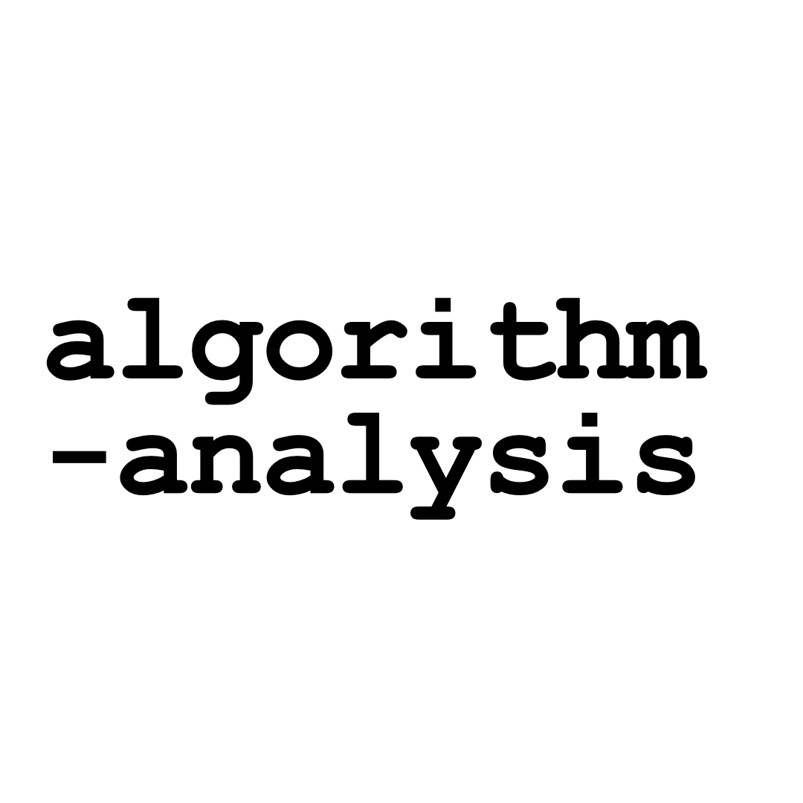

<a name="readme-top"></a>


[![Activity][activity-shield]][activity-url]
[![Contributors][contributors-shield]][contributors-url]
[![Forks][forks-shield]][forks-url]
[![Stargazers][stars-shield]][stars-url]
[![Issues][issues-shield]][issues-url]
[![MIT License][license-shield]][license-url]


<!-- PROJECT LOGO -->
<br />
<div align="center">
  <a href="https://github.com/JoHyukJun/algorithm-analysis">
    
  </a>

  <h3 align="center">algorithm-analysis</h3>

  <p align="center">
    An endless algorithm study project
    <br />
    <a href="https://github.com/JoHyukJun/algorithm-analysis"><strong>Explore the docs »</strong></a>
    <br />
    <br />
    <a href="https://unluckystrike.com/blog/">View descriptions</a>
    ·
    <a href="https://github.com/JoHyukJun/algorithm-analysis/issues">Report Bug</a>
    ·
    <a href="https://github.com/JoHyukJun/algorithm-analysis/issues">Request Feature</a>
  </p>
</div>


<!-- TABLE OF CONTENTS -->
<details>
  <summary>Table of Contents</summary>
  <ol>
    <li>
      <a href="#about-the-project">About The Project</a>
      <ul>
        <li><a href="#built-with">Built With</a></li>
      </ul>
    </li>
    <li>
      <a href="#getting-started">Getting Started</a>
      <ul>
        <li><a href="#prerequisites">Prerequisites</a></li>
        <li><a href="#installation">Installation</a></li>
      </ul>
    </li>
    <li><a href="#usage">Usage</a></li>
    <li><a href="#roadmap">Roadmap</a></li>
    <li><a href="#contributing">Contributing</a></li>
    <li><a href="#license">License</a></li>
    <li><a href="#contact">Contact</a></li>
    <li><a href="#acknowledgments">Acknowledgments</a></li>
  </ol>
</details>


<!-- ABOUT THE PROJECT -->
## About The Project

[![Product Name Screen Shot][product-screenshot]](https://unluckystrike.com/blog/)

It aims to cultivate algorithmic analysis ability, which is one of the developer's basic skill-sets, solve various problems, and continue to improve.

<p align="right">(<a href="#readme-top">back to top</a>)</p>


### Built With


* [![Python][Python]][Python-url]
* [![C++][C++]][C++-url]
* [![Swift][Swift]][Swift-url]

<p align="right">(<a href="#readme-top">back to top</a>)</p>


<!-- GETTING STARTED -->
## Getting Started

To get a local copy up and running follow these simple example steps.

### Prerequisites

This is an example of how to list things you need to use the software and how to install them.
* python
  ```sh
  python3
  ```

### Installation

Perform the following procedure to install the required package.

1. Clone the repo
   ```sh
   git clone https://github.com/JoHyukJun/algorithm-analysis.git
   ```

<p align="right">(<a href="#readme-top">back to top</a>)</p>


<!-- USAGE EXAMPLES -->
## Usage

_For more examples, please refer to the [Documentation](https://unluckystrike.com/blog/)_

<p align="right">(<a href="#readme-top">back to top</a>)</p>


<!-- ROADMAP -->
## Roadmap

- [x] Add daily study
- [x] Add basic template code

See the [open issues](https://github.com/JoHyukJun/algorithm-analysis/issues) for a full list of proposed features (and known issues).

<p align="right">(<a href="#readme-top">back to top</a>)</p>


<!-- CONTRIBUTING -->
## Contributing

Contributions are what make the open source community such an amazing place to learn, inspire, and create. Any contributions you make are **greatly appreciated**.

If you have a suggestion that would make this better, please fork the repo and create a pull request. You can also simply open an issue with the tag "enhancement".
Don't forget to give the project a star! Thanks again!

1. Fork the Project
2. Create your Feature Branch (`git checkout -b feature/amazing-feature`)
3. Commit your Changes (`git commit -m 'feat: Add some amazing-feature'`)
* commit message
  ```git
  <type>[optional scope]: <description>
  
  [optional body]

  [optional footer(s)]
  ```
* commit type
  ```git
  - feat: a commit of the type feat introduces a new feature to the codebase
  - fix: a commit of the type fix patches a bug in your codebase
  ```
4. Push to the Branch (`git push origin feature/amazing-feature`)
5. Open a Pull Request

<p align="right">(<a href="#readme-top">back to top</a>)</p>


<!-- LICENSE -->
## License

Distributed under the MIT License. See `LICENSE.txt` for more information.

<p align="right">(<a href="#readme-top">back to top</a>)</p>


<!-- CONTACT -->
## Contact

JO HYUK JUN - hyukzuny@gmail.com

Project Link: [https://github.com/JoHyukJun/algorithm-analysis](https://github.com/JoHyukJun/algorithm-analysis)

<p align="right">(<a href="#readme-top">back to top</a>)</p>


<!-- ACKNOWLEDGMENTS -->
## Acknowledgments
* [acmicpc](https://www.acmicpc.net/)
* [programmers](https://programmers.co.kr/)
* [leetcode](https://leetcode.com/)

<p align="right">(<a href="#readme-top">back to top</a>)</p>


<!-- MARKDOWN LINKS & IMAGES -->
<!-- https://www.markdownguide.org/basic-syntax/#reference-style-links -->
[contributors-shield]: https://img.shields.io/github/contributors/JoHyukJun/algorithm-analysis.svg?style=for-the-badge
[contributors-url]: https://github.com/JoHyukJun/algorithm-analysis/graphs/contributors
[activity-shield]: https://img.shields.io/github/commit-activity/m/JoHyukJun/algorithm-analysis.svg?style=for-the-badge
[activity-url]: https://github.com/JoHyukJun/algorithm-analysis/pulse
[forks-shield]: https://img.shields.io/github/forks/JoHyukJun/algorithm-analysis.svg?style=for-the-badge
[forks-url]: https://github.com/JoHyukJun/algorithm-analysis/network/members
[stars-shield]: https://img.shields.io/github/stars/JoHyukJun/algorithm-analysis.svg?style=for-the-badge
[stars-url]: https://github.com/JoHyukJun/algorithm-analysis/stargazers
[issues-shield]: https://img.shields.io/github/issues/JoHyukJun/algorithm-analysis.svg?style=for-the-badge
[issues-url]: https://github.com/JoHyukJun/algorithm-analysis/issues
[license-shield]: https://img.shields.io/github/license/JoHyukJun/algorithm-analysis.svg?style=for-the-badge
[license-url]: https://github.com/JoHyukJun/algorithm-analysis/blob/master/LICENSE
[product-screenshot]: images/screenshot.png
[Python]: https://img.shields.io/badge/python-000000?style=for-the-badge&logo=python&logoColor=white
[Python-url]: https://www.python.org
[C++]: https://img.shields.io/badge/cpp-000000?style=for-the-badge&logo=cpp&logoColor=white
[C++-url]: https://learn.microsoft.com/ko-kr/cpp/cpp/welcome-back-to-cpp-modern-cpp?view=msvc-170
[Swift]: https://img.shields.io/badge/swift-000000?style=for-the-badge&logo=swift&logoColor=white
[Swift-url]: https://developer.apple.com/swift/